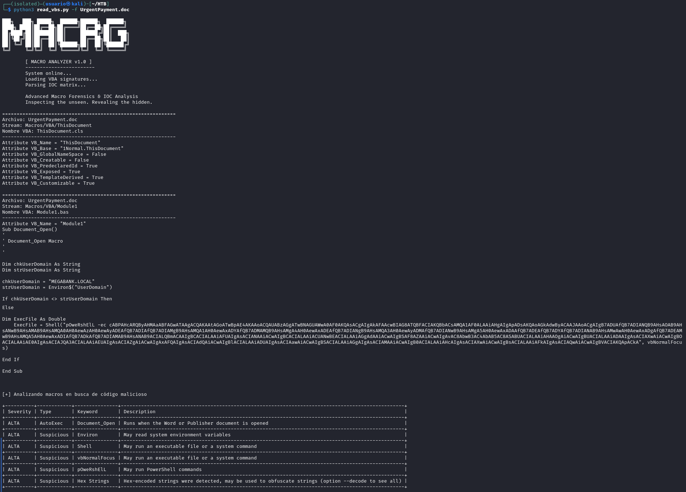

# 🧩 Análisis Forense de Macros en Documentos Office

Esta herramienta está diseñada para realizar un análisis estático y heurístico de documentos Office con macros embebidas, permitiendo identificar indicadores de compromiso, técnicas de ofuscación y comportamientos potencialmente maliciosos. 
El objetivo es proporcionar una visión clara y priorizada del riesgo asociado al archivo analizado.

🎯 Objetivos principales

- Extraer y visualizar el contenido completo de las macros VBA.
- Clasificar indicadores según su severidad (ALTA, MEDIA, BAJA).
- Detectar patrones asociados a ejecución de comandos, exfiltración o carga de payloads.
- Identificar técnicas de ofuscación comunes en malware distribuido mediante documentos Office.
- Presentar los resultados en un formato tabular legible y ordenado por prioridad.

🛠️ Funcionamiento general
El análisis se realiza en dos fases complementarias:

1. Extracción de macros
La herramienta utiliza oletools para inspeccionar el documento y extraer cada macro presente. Para cada flujo VBA detectado se muestra:

- Nombre del archivo interno
- Ruta del stream OLE
- Nombre del módulo VBA
- Código fuente completo

Esta fase permite al analista revisar manualmente el contenido y detectar patrones sospechosos o técnicas de evasión.

2. Análisis heurístico de indicadores

- Una vez extraído el código, se ejecuta un análisis basado en:
- Indicadores generados por olevba (AutoExec, Suspicious, IOC, etc.)
- Reglas adicionales definidas en la herramienta (uso de Shell, CreateObject, URLs, PowerShell, ofuscación, etc.)
- Clasificación automática por severidad mediante un mapa extensible

Los resultados se presentan en una tabla ordenada por prioridad, facilitando la identificación rápida de comportamientos maliciosos.

📊 Ejemplo de salida tabular

La herramienta genera una tabla con los siguientes campos:

- Severity — Nivel de riesgo asignado
- Type — Categoría del indicador
- Keyword — Palabra clave detectada
- Description — Explicación del comportamiento

Este formato permite documentar el análisis de forma clara y reutilizable en informes forenses o writeups técnicos.

🔍 Casos de uso

- Análisis de campañas de phishing basadas en documentos Office
- Identificación de macros con ejecución automática (AutoExec)
- Detección de payloads descargados mediante PowerShell o WScript
- Revisión de técnicas de ofuscación en VBA
- Preparación de informes DFIR y documentación de incidentes
